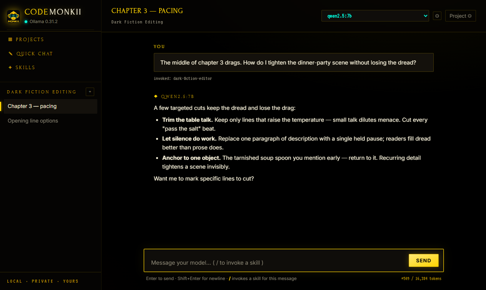
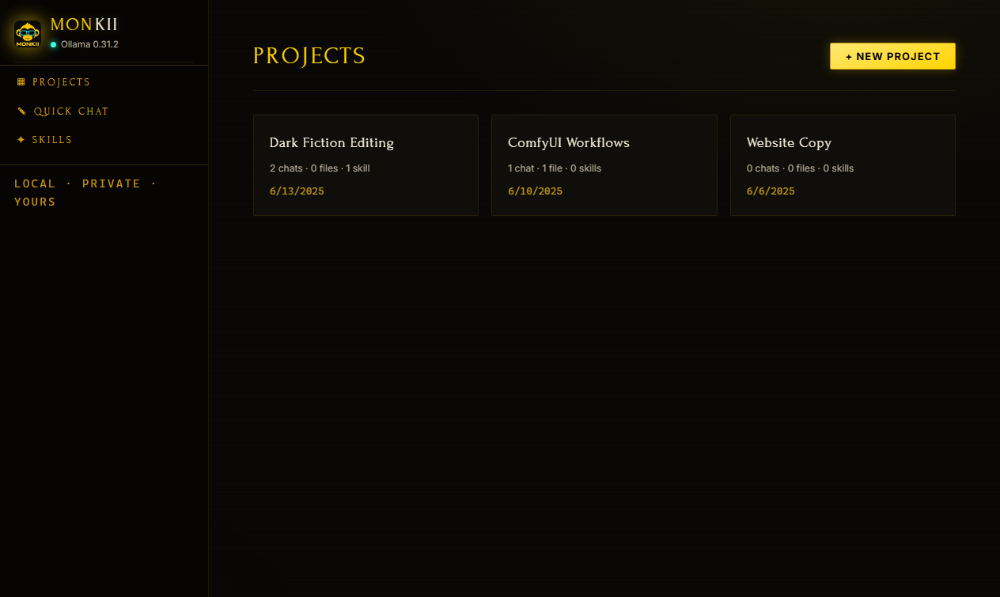
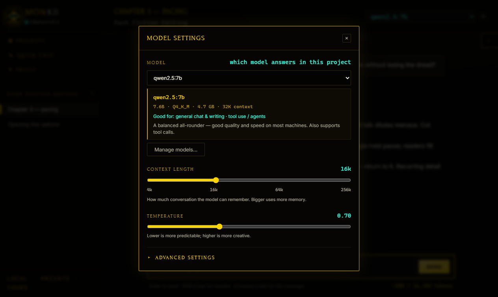
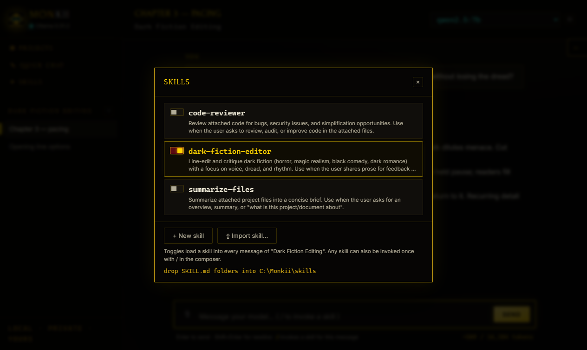

# 🐒 Monkii

A local, private LLM studio for [Ollama](https://ollama.com) — projects, Claude-style skills, and live file knowledge. Local by default: out of the box, nothing ever leaves your machine. When your hardware can't carry the model you need, an **optional** [OpenRouter](https://openrouter.ai) key adds remote models — per chat, clearly badged, never implicit.



<table>
  <tr>
    <td width="50%"></td>
    <td width="50%"></td>
  </tr>
  <tr>
    <td align="center"><em>Projects overview</em></td>
    <td align="center"><em>Model settings — size, specs & usage recommendation</em></td>
  </tr>
  <tr>
    <td width="50%"></td>
    <td width="50%" valign="top">
      <br>
      <strong>What you're looking at</strong>
      <ul>
        <li>Claude-format <strong>skills</strong> as per-project toggles or <code>/</code> per message</li>
        <li>A live <strong>token / context</strong> readout in the composer</li>
        <li>Per-project <strong>model settings</strong> with a size &amp; use-case recommendation</li>
        <li>Seven switchable themes — four dark, three light (shown: <strong>Cyber Deco</strong>, the default) — in Preferences → Theme</li>
      </ul>
    </td>
  </tr>
</table>

## Quick start

```powershell
git clone https://github.com/codalanguez/Monkii.git
cd Monkii
npm install        # first time only
npm start          # then open http://localhost:8113
npm test           # unit tests for the OpenRouter adapter boundary
```

On Windows you can also just double-click **`Start Monkii.cmd`** — it starts Ollama if needed and opens the app.

Requires **Node.js 18+** and **Ollama** running locally (`ollama serve`, or the Ollama app) with at least one model pulled, e.g. `ollama pull llama3.2`.

## Desktop app

Monkii can also run as a native desktop application (like the ComfyUI desktop app) instead of in a browser tab. An [Electron](https://www.electronjs.org) shell starts Ollama, boots the server on a free port, and shows the UI in its own window with a splash screen.

```powershell
npm install        # first time only — pulls in Electron
npm run desktop    # launches the desktop app
```

Or double-click **`Start Monkii Desktop.cmd`** (installs dependencies on first run).

**Preferences** — the ⚙ gear in the sidebar footer opens a panel with three storage locations, each user-changeable via a native folder picker (or resettable to its default):

- **Ollama models folder** — where pulled models live. If the app has to start Ollama itself, it asks once on first launch (Ollama default `~/.ollama/models`, or pick a folder). Applies the next time Monkii starts Ollama; also reachable via the **Monkii → Ollama Models Folder…** menu. If Ollama is already running, it uses whatever Ollama is configured with.
- **Projects & chats folder** — where conversations and project settings are saved. Changing it restarts the server and reloads the UI; existing chats stay in the old folder (move the JSON files manually if you want them along).
- **Skills folder** — where `SKILL.md` folders are scanned from. Point it at `~\.claude\skills` to use your Claude Code skills as-is.

Each location's env var (`OLLAMA_MODELS`, `MONKII_DATA_DIR`, `MONKII_SKILLS_DIR`) always wins over the saved preference and shows as read-only in the panel.

### Build a standalone installer

To produce a Windows installer (`.exe`) you can hand to another machine — no Node required on the target:

```powershell
npm run dist       # outputs Monkii Setup <version>.exe under dist/
```

The installer is a standard NSIS setup: install-location picker, Start-menu entry, desktop shortcut, uninstaller. It installs per-user (no admin needed). The target machine only needs [Ollama](https://ollama.com/download).

When running as an installed app, project data and skills live in `%APPDATA%\Monkii` (`data\projects` and `skills`), so updates and uninstalls never touch your chats; the bundled sample skills are copied there on first run. A repo checkout (`npm start` / `npm run desktop`) keeps everything repo-local as before. `MONKII_DATA_DIR` / `MONKII_SKILLS_DIR` env vars override either way.

The build config lives in `package.json` under `"build"`; icon assets are in `electron/build/`. The desktop shell lives entirely in `electron/` and reuses the server unchanged — `npm start` still runs it headless in a browser.

**Code signing** — point electron-builder at a PFX and it signs the app, uninstaller, and installer (SHA-256 + RFC-3161 timestamp):

```powershell
$env:CSC_LINK = "$HOME\.monkii-signing\monkii-codesign.pfx"
$env:CSC_KEY_PASSWORD = Get-Content "$HOME\.monkii-signing\pfx-password.txt"
npm run dist
```

A self-signed certificate (as generated here) makes signatures verify on machines that trust it, but other people's PCs still see "unknown publisher" and SmartScreen still warns — only a CA-issued certificate (Azure Trusted Signing, or an OV cert from SSL.com/Certum, or SignPath's free open-source program) fixes that. Swap the PFX path when you get one; nothing else changes.

## Features

### Projects (like Claude Projects)
Each project bundles:
- **Instructions** — a system prompt applied to every chat in the project
- **Knowledge** — files and folders attached from your machine
- **Skills** — always-on skills for the project
- **Chats** — as many conversations as you like, each remembering its model

Everything is stored as plain JSON under `data/projects/` — easy to back up, easy to inspect, never leaves your disk.

### Skills (Claude skill format)
Drop a folder into `skills/`, containing a `SKILL.md` with YAML frontmatter:

```
skills/
  my-skill/
    SKILL.md
```

```markdown
---
name: my-skill
description: One line describing when to use this skill.
---

Instructions the model follows when the skill is loaded…
```

Or create one in-app: **✦ Skills → + New skill** scaffolds the folder and a starter `SKILL.md` from a built-in template (`lib/skill-template.md`) — then edit the file to write the instructions. Also available from the desktop menu (**Monkii → Skills → New Skill…**).

Existing skills can be brought in with **⇪ Import skill…** — pick a skill folder, a `SKILL.md`, or a packaged **`.skill` file** (a zip of the skill folder; plain `.zip` works too) and it's copied/extracted into your skills directory with size and path-safety checks.

Prefer not to write it yourself? **✦ Create with model** has one of your installed Ollama models draft the instructions from your name + description brief. The model picker recommends the best installed candidate for the job (solid instruct families at GPU-friendly sizes; reasoning and cloud models rank lower). Review the generated `SKILL.md` before relying on it.

Two ways to use a skill:
1. **Project toggle** — switch it on in the project panel; it loads into every message.
2. **Slash invoke** — type `/` in the composer and pick a skill; it loads for that message only (and stays in the conversation history from then on).

Existing Claude Code skills work as-is — point Monkii at them:

```powershell
$env:MONKII_SKILLS_DIR = "$HOME\.claude\skills"; npm start
```

### File & directory knowledge
Attach any file or folder via the built-in browser. Contents are **re-read from disk on every message**, so your latest edits are always what the model sees. Directories are walked recursively (skipping `node_modules`, `.git`, build output, binaries) with size budgets so you don't blow out the context window.

Attach at **two levels**:
- **Project knowledge** (the inspector's Knowledge panel) — shared by every chat in the project.
- **Chat knowledge** (the 📎 in the chat header) — scoped to just that one chat. Great for a quick chat where you want to drop in a few files without setting up a project; shown as chips above the composer and counted in the token meter.

### Large attachments: retrieval instead of overflow

Attach something big — a whole manuscript, a codebase — and Monkii embeds it **on-device** (via an Ollama embedding model such as `nomic-embed-text`) and injects only the passages relevant to your question, instead of dumping the entire file into every prompt. Small attachments (< 64 KB) are still included whole; anything larger is searched. Indexing starts **in the background the moment you attach** (with an "indexing %" badge), so the first message doesn't wait on it. The index is cached on disk by file signature — so a file is embedded once and reused until it changes — and it's removed when you detach the attachment or delete the project. Entirely offline — and if no embedding model is installed, Monkii offers to pull the recommended one on first run, or simply falls back to including the file as before. Set `MONKII_RETRIEVAL=off` to always include attachments whole and write no index at all.

#### Benchmarks

<!-- BENCH:START (auto-generated by `npm run bench` — do not edit by hand) -->
Measured end-to-end against a live Ollama on a sample laptop — **11th Gen Intel Core i9-11900H · 16 threads · 64 GB RAM · NVIDIA GeForce RTX 3070 Laptop GPU · 8192 MiB**, Ollama 0.31.2, embed `nomic-embed-text:latest`, chat `qwen2.5:7b`. Timings come from Ollama's own `prompt_eval_duration`.

**Retrieval by file size** — chunk + embed once, then rank per question:

| Attachment | Chunks | Index build (one-time) | Warm query | Prompt vs full dump | Fact buried at 92% depth |
|---|--:|--:|--:|--:|:--|
| 128 KB (~33k tok) | 154 | 5.6 s | 119 ms | **−88%** | ✓ found |
| 512 KB (~131k tok) | 768 | 23.1 s | 196 ms | **−88%** | ✓ found |
| 2 MB (~524k tok) | 3,219 | 92.2 s | 388 ms | **−88%** | ✓ found |

The old behavior caps a file at 120 KB, so on the 2.0 MB file it only ever saw the first ~6% — and would miss a fact sitting at 92% depth. Retrieval indexes the whole file and found it every time, injecting ~4k tokens instead of ~31k.

**Time to first token** — `qwen2.5:7b`, 32k context:

| Prompt | Tokens | Prefill |
|---|--:|--:|
| Retrieved passages | 3,542 | **1.7 s** |
| Full dump (120 KB cap) | 26,713 | 17.6 s |

Retrieval reaches the first token **~10.7× sooner**. And a full manuscript (500k+ tokens) is far over a 32k window and can't be sent at all — retrieval is what makes it fit.

**Long chats stay open** — biggest attachment; retrieval holds the system prompt flat while history grows:

| Turns | System tok | History tok | Total | of 32k context |
|--:|--:|--:|--:|--:|
| 5 | 3,630 | 529 | 4,159 | 13% |
| 20 | 3,630 | 2,118 | 5,748 | 18% |
| 60 | 3,630 | 6,358 | 9,988 | 30% |

The system prompt stays constant as the conversation grows. With the old dump it would pin the system at ~31k tokens, so a long chat overflows the 32k window and older messages get trimmed.

> **Caveats.** The *first* index of a huge file scales with size (~92.2 s for the 2.0 MB file; one-time, cached until it changes). The index stores the chunked source **text** (not just vectors) plus the file path in plaintext under the data dir — gitignored, removed when you detach the attachment, and size-capped; `MONKII_RETRIEVAL=off` avoids it. It's currently ~12–16× the source (JSON-float vectors — 32.5 MB for the 2.0 MB doc); a binary vector store is a tracked follow-up. Warm-SSD read caching saves only sub-millisecond per message; the cache that matters is the index.

<sub>Auto-generated by `npm run bench` · last measured 2026-07-12.</sub>
<!-- BENCH:END -->

### Ollama
- Auto-detects Ollama at `http://localhost:11434` (override with `OLLAMA_HOST`; bind-style values like `0.0.0.0` are normalized automatically)
- Model picker per chat, streaming responses, stop button
- **↻ Retry** on the conversation's last reply — re-runs your last prompt (with the same invoked skills) under whatever model is currently selected, so you can switch models and compare takes; available after errors and Stop too
- Health indicator in the sidebar
- Update check (**off by default, opt-in**): when enabled, a cached daily check notices a newer Ollama release and shows a download pill plus (in the desktop app) a popup offering to download it. Turn it on in Preferences → Update check, or `MONKII_UPDATE_CHECK=on`

### Themes

Seven presets in **Preferences → Theme**, applied instantly and remembered (no restart, no flash on boot):

- **Dark** — Cyber Deco (default), Speakeasy Noir, Gothic Library, Midnight
- **Light** — Parchment, Daylight, Porcelain

The whole UI runs on CSS variables (every accent, glow, and surface derives from the theme's tokens), and all seven are contrast-checked to WCAG AA. Custom colors, fonts, a system-follow toggle, and density controls are on the [roadmap](ROADMAP.md).

### Optional: remote models (OpenRouter)

If your machine can't run the model your work needs, add an [OpenRouter](https://openrouter.ai) API key in **Preferences → Remote models** and the model picker grows an "OpenRouter — remote" group next to your local models. Browse the full catalog (☁ next to the picker) with context lengths and per-token prices, ★ the ones you want, and pick them per chat like any local model.

The trust model is explicit, not fine print:

- **Nothing goes remote unless you pick a remote model for a chat.** Local chats are untouched, and a fresh install has no key and makes no remote calls at all.
- **Privacy routing by default** — remote requests are restricted to providers that **don't log or train on prompts** (`data_collection: deny`); widen it in Preferences if you want more provider choice.
- Chats using a remote model send that chat's messages, project instructions, and attachments to openrouter.ai and the model's provider — a **☁ remote** badge sits beside the picker whenever that's the case.
- **Costs are visible**: every remote reply shows its exact $ cost and token counts, the chat header totals the conversation's spend, and Preferences shows what your key has used. (That readout means opening Preferences with a key saved checks your balance with OpenRouter — key metadata only, never chat content, cached for a minute.)
- **Reasoning models work properly** — R1-class models stream their thinking into a collapsible block instead of appearing frozen; it's saved with the message.
- The browse dialog has a **"free only"** filter (the `:free` variants cost nothing, rate-limited), and a per-project `or_route` option routes to the cheapest (`floor`) or fastest (`nitro`) provider. On Claude/Gemini models the system prompt is **cache-marked** automatically — cache *writes* cost slightly more, but every following message in a session reads the instructions+attachments back at a deep discount, which is exactly Monkii's resend pattern.
- Retrieval embeddings stay **local-only**: large attachments are indexed on-device via Ollama even when the chat model is remote.
- The API key is stored OS-encrypted (DPAPI via Electron `safeStorage`), is only handed to the local server process, and never reaches the browser UI.

## Configuration

| Env var | Default | Purpose |
|---|---|---|
| `PORT` | `8113` | Web UI port |
| `OLLAMA_HOST` | `http://localhost:11434` | Ollama server address |
| `MONKII_SKILLS_DIR` | `./skills` | Where to scan for skills |
| `MONKII_FS_ROOTS` | *(unset)* | Semicolon-separated list of directories the file browser and attachments are restricted to, e.g. `C:\projects;D:\writing`. When unset, the **desktop app fences to your home folder** by default (manage it in Preferences → File access); a repo checkout (`npm start`) is whole-disk unless you set this. |
| `MONKII_UPDATE_CHECK` | `off` | Set to `on` to enable the daily Ollama-release check (opt-in; the only thing that ever leaves the machine). In the desktop app, toggle it in Preferences → Update check. |
| `MONKII_RETRIEVAL` | `on` | Set to `off` to always include attachments whole (no embedding/retrieval) |
| `MONKII_EMBED_MODEL` | *(auto-detect)* | Force a specific Ollama embedding model; otherwise the first installed embed model is used |
| `MONKII_EMBED_DIR` | *(beside data dir)* | Where the on-disk embedding indexes are stored |
| `MONKII_OPENROUTER_KEY` | *(unset)* | OpenRouter API key enabling optional remote models. In the desktop app, set it in Preferences → Remote models instead (stored OS-encrypted); the env var overrides that. Unset = fully local. |
| `MONKII_OR_DATA_COLLECTION` | `deny` | Remote privacy routing: `deny` restricts remote chats to providers that don't log/train on prompts; `allow` widens provider choice. Toggle in Preferences → Remote models. |

## Security

Monkii is a single-user local app, hardened accordingly:

- **Loopback only** — the server binds `127.0.0.1`; it is never reachable from the network.
- **DNS-rebinding protection** — requests with a `Host` header other than `localhost`/`127.0.0.1` are rejected, so a malicious website that points its own domain at your loopback address gets a 403.
- **CSRF protection** — cross-origin requests (any `Origin` other than the app's own) are rejected.
- **Content Security Policy** — scripts run from the app's own origin only; no eval, no inline scripts, no third-party script sources. Plus `nosniff`, `no-referrer`, and a locked-down `Permissions-Policy`.
- **Filesystem scoping** — the desktop app fences browsing *and* attachment reads to your **home folder by default** (widen it in Preferences → File access: add folders or allow the whole disk). `MONKII_FS_ROOTS` overrides it; the check runs both when attaching and again on every read, and resolves realpath so a symlink/junction can't escape the allowlist.
- **Input validation** — project/skill ids are strictly validated (no path traversal), all model output is HTML-escaped before rendering, and errors return generic JSON with no stack traces.
- **Untrusted attachments** — attached files and retrieved passages are wrapped as clearly-marked *untrusted reference data*, with an explicit instruction to the model to treat them as content and never obey instructions found inside them; content that reads like an injection (e.g. "ignore previous instructions", forged `System:`/`Assistant:` turns) is flagged in the prompt's attachment notes.
- **Remote backend guarded** — with no OpenRouter key configured, the server refuses remote-model requests outright (nothing is ever sent with an empty key, even for a stale chat that still names a remote model); the key is OS-encrypted at rest, handed only to the local server process, never exposed to the browser UI, and provider streams are size-capped and translated at one boundary.
- **On-disk retrieval cache** — when a large attachment is searched (see [retrieval](#large-attachments-retrieval-instead-of-overflow)), its embedding index is written under `EMBED_DIR` (default beside your data dir; `%APPDATA%\Monkii\embeddings` for the installed app). That index contains the chunked source **text in plaintext**, like your chats — so it's gitignored, deleted when you detach the attachment or delete the project, and size-capped (least-recently-used eviction). `MONKII_RETRIEVAL=off` disables it entirely, and directory junctions inside an attached folder can't escape `MONKII_FS_ROOTS`.

Your chats and project data stay on your disk. UI fonts are bundled locally (no Google Fonts requests), so out of the box the **only** outbound connection is to your local Ollama — nothing leaves your machine. Two opt-ins can change that, both off until you act: a daily Ollama-version check to GitHub (**off by default**, no data sent even when on; Preferences → Update check or `MONKII_UPDATE_CHECK=on`), and [remote models via OpenRouter](#optional-remote-models-openrouter), which only ever affect chats where you explicitly picked a remote model — and say so with a badge.

The desktop shell adds its own hardening: sandboxed renderer with context isolation, a navigation guard (the window can only ever display the app — external links open in your real browser), all web permission requests (camera, mic, location…) denied, and preferences IPC that only accepts calls from the app's own pages.

## Roadmap

Monkii's plans live in **[ROADMAP.md](ROADMAP.md)** — grouped by the promise each item serves: keeping it **local-first**, **honest**, and **yours**. The guiding rule for everything there: nothing ever *requires* an account, a cloud service, or sending your data off the machine — anything remote is opt-in, per chat, and labeled.

A few of what's next: search across chats & projects, edit·regenerate·branch messages, backup & wipe controls, theming, and completion notifications. (Local retrieval over big attachments and optional remote models via OpenRouter have already shipped.) See the [full roadmap →](ROADMAP.md)

## Layout

```
server.js               entry point: middleware, routers, listen
lib/
  config.js             env + constants (ports, paths, context budgets)
  security.js           Host/Origin validation, CSP, fs allowlist
  store.js              project JSON persistence
  skills.js             SKILL.md discovery + frontmatter parsing
  attachments.js        reading knowledge from disk (cached by size+mtime)
  knowledge.js          per-attachment dump-vs-retrieve orchestration
  retrieval.js          on-device embeddings + persisted index + top-K search
  prompt.js             system prompt assembly
  ollama.js             Ollama HTTP client + embeddings + release update check
  stream.js             NDJSON tee helper (chat + pull share it)
  tokens.js             rough token estimate
  options.js            Ollama generation-option sanitizer
  log.js                error logging to a rotating file
routes/
  projects.js           projects / chats / attachments CRUD
  skills.js             skill listing endpoints
  fs.js                 file-browser directory listings
  ollama.js             health, models, update check, streaming chat
public/
  index.html            single-page UI shell
  style.css             the seven themes (CSS-variable presets)
  js/                   ES modules, one per feature:
    main.js             wiring + startup
    state.js            shared client state
    api.js              JSON fetch client
    util.js             DOM helpers ($, esc, toast)
    markdown.js         safe markdown renderer
    status.js           health indicator, model list, update pill
    skills.js           skill catalog, toggles + "/" invocation
    skill-create.js     adding skills: template, model-written, import
    model-settings.js   per-project Ollama options (context, temperature, advanced)
    views.js            main-area view switching (welcome / projects / chat)
    modal.js            shared open/close behavior for backdrop modals
    ctxmenu.js          right-click menus (chats, projects, messages, skills)
    projects.js         projects page, lifecycle + inspector
    attachments.js      knowledge panel + file browser
    chat.js             messages, streaming, stop
    context-meter.js    live token/context estimate in the composer
    model-manager.js    pull / delete / disk usage for Ollama models
    model-info.js       selected-model size, specs + usage recommendation
    model-bootstrap.js  first-run offers to pull a chat model + the retrieval embed model
    prefs.js            preferences panel (storage folders; desktop app only)
skills/                 your skills (3 samples included)
data/projects/          project + chat storage (JSON, gitignored)
electron/               desktop shell, one module per concern
  main.js               entry point: window + app lifecycle
  runtime.js            shared state (window, server process, port)
  settings.js           settings.json + storage-location resolution
  dialogs.js            native-dialog helpers
  ollama.js             starting Ollama + the models-folder question
  server.js             fork/wait/restart of the Express server
  menu.js               app menu with live Projects & Skills submenus
  prefs-ipc.js          preferences IPC (validated senders)
  preload.js            contextBridge exposed to the web UI
  loading.html          themed splash shown while the server boots
  build/                icon assets + installer resources
```

Each module carries a header comment explaining its responsibility.
